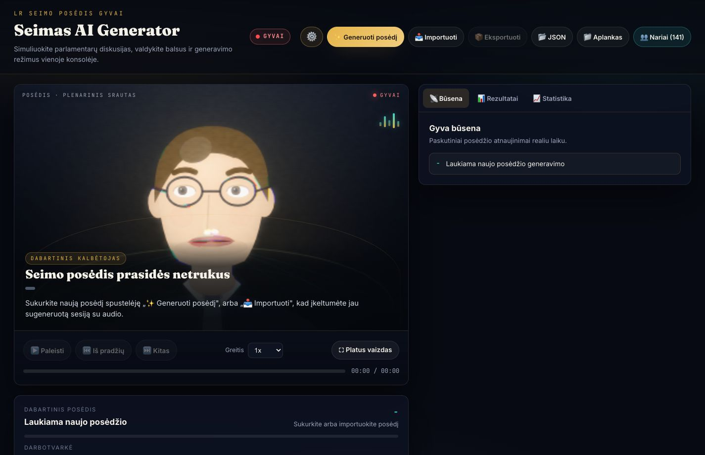
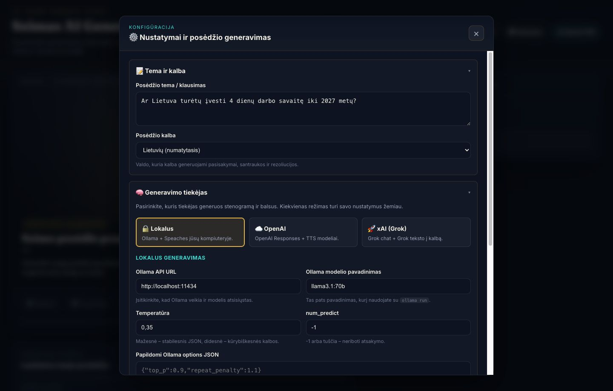
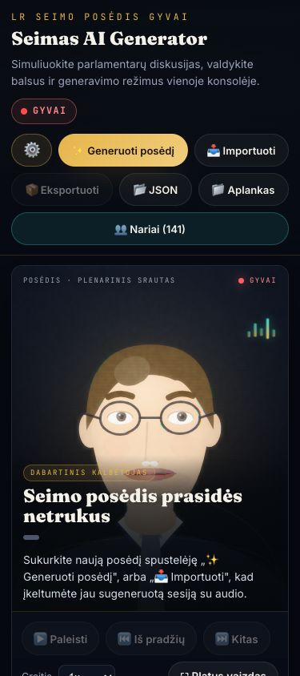

# Seimas AI Live Stream Generator

Lietuvos Respublikos Seimo posėdžių simuliatorius su ChatGPT plano, OpenAI API, xAI (Grok) ir lokalia (Ollama + Speaches) integracija. Programa skirta naudoti savo kompiuteryje. Generuoja realistiškus parlamentinius posėdžius su visais 141 Seimo nariu.

## 🚀 Greitas startas

```bash
npm install      # įdiegti priklausomybes (vieną kartą)
npm run dev      # paleisti dev serverį
```

Atidarykite naršyklėje adresą, kurį parodo Vite (paprastai **http://localhost:5173**; jei portas užimtas, Vite pasirenka kitą, pvz. `5174`).

## ChatGPT prisijungimas ir posėdžio generavimas

ChatGPT režimu stenogramą galima generuoti su tinkamos paskyros ChatGPT plano limitais, neįvedant OpenAI API rakto.

1. Paleiskite `npm install` ir `npm run dev` **tame pačiame kompiuteryje, kuriame naudojate naršyklę**.
2. Atidarykite `http://localhost:5173` arba Vite parodytą `localhost` adresą.
3. Atidarykite **⚙️ Nustatymai → Generavimo tiekėjas → ChatGPT**.
4. Spauskite **Continue with ChatGPT**. OpenAI lange prisijunkite ir suteikite leidimą naudoti ChatGPT planą.
5. Grįžkite į Seimas programą, palaukite, kol įsikels paskyros modeliai, ir pasirinkite stenogramos modelį.
6. Įveskite temą, pasirinkite kalbą ir spauskite **🚀 Generuoti Seimo posėdį**.

**Balsai:** šis režimas naudoja atskirą vietinį **Speaches** serverį. Jo adresą ir modelį nustatykite **Lokalus** kortelėje, tada grįžkite į **ChatGPT**. Jei balsų nereikia, palikite įgarsinimą išjungtą. ChatGPT prisijungimas nesuteikia prieigos prie OpenAI API įgarsinimo.

**Paleidimas:** veikia per `npm run dev` arba `npm run build` ir `npm run preview`. Vien statinių `dist/` failų nepakanka: prisijungimui ir generavimui reikalingi vietiniai Node maršrutai. Prisijungimo callback veikia per `127.0.0.1` pasirinktame laisvame porte. Šiam vietiniam srautui nereikia iš anksto įvesti client ID ar client secret.

**Paskyra:** prieinami modeliai ir generavimo limitai priklauso nuo paskyros. OAuth duomenys įrašomi į Git ignoruojamą `.chatgpt/` aplanką, o API raktų režimai lieka atskirai. Norėdami pakeisti paskyrą, spauskite **Atsijungti / Sign out**, tada prisijunkite iš naujo.

**Patikrinimo būsena:** build ir sintetiniai stream testai patikrinti; tikras OpenAI prisijungimas ir posėdžio generavimas su vartotojo paskyra dar nepatvirtinti. Žinomi funkcionalumo trūkumai: atsijungimo metu vykstantis tokeno atnaujinimas gali atkurti prisijungimą; paskyrai be el. pašto lauko modelių sąrašas gali neįsikelti.

**English:** Run Seimas and your browser on the same computer, open the app through `localhost`, select **ChatGPT**, and click **Continue with ChatGPT**. Authorize plan usage, return, choose an account-provided model, and generate a session. Speech uses a separate local Speaches server. Live account authorization remains unverified; the sign-out race and missing-email model-loading issue remain unresolved.

Išsamus vadovas: [ChatGPT plan session generation](docs/chatgpt-signin.md).

## Sąsajos ekrano nuotraukos

### Gyvas posėdžio vaizdas



### Nustatymai ir generavimo tiekėjai



### Mobilus vaizdas



## 🔑 Išbandymas be API rakto (offline peržiūra)

**Programą galima visiškai išbandyti be jokio API rakto** – tiesiog importuokite jau sugeneruotą sesiją su garsu. Repozitorijoje yra paruoštas pavyzdys: [`test-import-offline-preview.zip`](test-import-offline-preview.zip) (posėdžio JSON + iš anksto sugeneruoti `.mp3` balsai).

1. Paleiskite programą (`npm run dev`) ir atidarykite ją naršyklėje.
2. Viršutinėje juostoje spauskite **📥 Importuoti**.
3. Failų lange pasirinkite **`test-import-offline-preview.zip`** (galima rinktis ir kelis failus arba aplanką su `*.json` + `audio/`).
4. Sesija įsikels iškart – matysite posėdžio pavadinimą, kalbėtojus ir darbotvarkę. Spauskite **▶️ Paleisti**.
5. Balsai grojami tiesiai iš ZIP archyvo, **API raktas nereikalingas** ir nesiunčiama jokia užklausa į išorę. Garso generavimas (TTS) reikalingas tik tada, kai norite sukurti **naują** posėdį pasirinktu tiekėju.

> 💡 Patarimas: importuotą sesiją galima vėl eksportuoti per **📦 Eksportuoti** – gausite tokį patį `.zip`, tinkamą pakartotinei peržiūrai be papildomų kaštų.

## 🖥️ Platus vaizdo srautas (šoninio skydelio slėpimas)

Po vaizdo grotuvu, valdiklių eilutėje, yra mygtukas **⛶ Platus vaizdas**. Jį paspaudus dešinysis skydelis (būsena / rezultatai / statistika) paslepiamas, o kalbantis veidas išsiplečia per visą plotį – patogu transliacijai ar pristatymui. Pakartotinis paspaudimas (**◀ Rodyti skydelį**) jį grąžina. Pasirinkimas įsimenamas naršyklėje.

## ⚙️ Nustatymai (modalas)

Visi konfigūracijos laukai dabar atidaromi per **⚙️ piktogramą** viršutinėje juostoje (arba mygtuką **✨ Generuoti posėdį**) ir rodomi moderniame modaliniame lange virš posėdžio turinio. Modalas tvarkingai suskirstytas į tris sekcijas: *Tema ir kalba*, *Generavimo tiekėjas* (Lokalus / OpenAI / ChatGPT / xAI) ir *Įgarsinimas*. Uždaroma kryžiuku, paspaudus už lango arba klavišu `Esc`.

## Stakeholder Brief
- **Status (2025-11-15):** Feature-complete beta. Core simulator, bilingual prompt scaffolding, and local text-to-speech now run inside a React + Vite SPA (`src/App.jsx`) backed by the legacy simulation controller.
- **Value Proposition:** Enables communications, policy, and research teams to dry-run plenary debates with controllable topics, factions, and scripted realism before public sessions. Delivers JSON transcripts, live-playback UI, and optional audio for debriefs or press prep.
- **Required Inputs:** 
  - *None for a quick demo* — import `test-import-offline-preview.zip` via **📥 Importuoti** to replay a fully generated session (with audio) without any key.
  - For generating new sessions, one of: an authorized eligible ChatGPT account for plan usage, an OpenAI-compatible API key, an xAI (Grok) API key, or a local Ollama stack. Speech is configured separately.
  - Running Speaches server on the stakeholder device (`http://localhost:8000/v1`) with at least one Kokoro-derived TTS model downloaded (local mode only).
  - (For local simulations) An Ollama instance with the chosen LLM pulled locally (e.g., `ollama pull llama3.1:70b`).
- **UI Highlights:** refreshed dark-corporate React interface with a settings modal (⚙️ icon), four provider cards (Local / OpenAI / ChatGPT / xAI Grok), a collapsible sidebar for wide-screen video, bilingual prompts, and contextual status badges improves stakeholder demos without extra configuration.
- **Data Residency & Privacy:** Local mode stays on Ollama + Speaches. Remote mode calls the configured OpenAI-compatible Responses and TTS endpoints. Outputs and settings are stored locally in browser storage or session files. ChatGPT OAuth credentials are stored by the local Node integration in `.chatgpt/`; generation requests are sent to the selected provider.
- **Evaluation Checklist:** 
  1. Run `npm install && npm run dev`, then open `http://localhost:5173`.
  2. Fill topic + choose Lithuanian/English.
  3. Configure Ollama/Speaches or OpenAI-compatible endpoint details, then enable TTS if audio is needed.
  4. Generate a full session and confirm JSON download + optional audio playback.
- **Next Milestones:** (a) plug-in Lithuanian-native TTS voices once a model is integrated into Speaches, (b) add regression tests for bilingual prompts, (c) expose summarized analytics per session for executive dashboards.

## Funkcijos

### 🏛️ Pilnas Seimas
- **141 Seimo narys** su individualiais profiliais
- Tikros frakcijos: LSDP, TS-LKD, Nemuno aušra, DSVL, Liberalai, LVŽS, LLRA-KŠS ir kt.
- Autentiški asmenybės profiliai su tikslais, gebėjimais ir apribojimais

### 🤖 AI Stenogramų generavimas
- **OpenAI-compatible Responses API** integracija su pasirenkamu baziniu URL, stenogramos modeliu ir request options JSON
- Ypač detalūs pasisakymai su argumentais ir statistikomis
- 50-60 įvykių su išsamiais 150-400 žodžių tekstais
- Personalizuotos kalbos pagal kiekvieno nario ideologiją
- Realūs ekonominiai duomenys ir tarptautiniai pavyzdžiai
- Gilios diskusijos su tarpusavio klausimais ir atsakymais

### 💾 Sesijų archyvavimas
- `npm run dev` ir `npm run preview` paleidžia Node API (`POST /api/sessions`), kuris automatiškai išsaugo sugeneruotas stenogramas į `sessions/` katalogą (poaplankyje pagal sesijos datą).
- Naršyklėje stenogramos atsisiunčiamos JSON formatu arba įrašomos pasirinktame aplanke naudojant Failų sistemos API, jeigu nenaudojate Node API.
- `sessions/` kataloge kaupiama chronologinė posėdžių istorija JSON formatu ir garso išklotinėms paruoštuose aplankuose.

### 🌐 Dvikalbė generacija
- Vienu jungikliu pasirinkite lietuvių (numatytoji) arba anglų kalbą
- Parinktis veikia tiek GPT stenogramoms, tiek tiesioginiams atnaujinimams
- Kalbos pasirinkimas įsimenamas naršyklėje, tad nereikia keisti kiekvieną kartą

### ⚙️ Keturi generavimo režimai
- **🔒 Lokalus režimas:** stenogramos kuriamos per jūsų Ollama serverį, balsai – per Speaches TTS. Galima nurodyti Ollama modelį, temperatūrą, `num_predict` ir papildomą `options` JSON.
- **ChatGPT režimas:** prisijunkite per **Continue with ChatGPT**, pasirinkite paskyrai prieinamą modelį ir generuokite stenogramą su ChatGPT plano limitais. Balsams naudojamas vietinis Speaches; OpenAI API raktas stenogramai nereikalingas.
- **☁️ OpenAI režimas:** naudoja pasirinktą OpenAI arba OpenAI-compatible Responses endpointą stenogramoms ir atskirą `/audio/speech` TTS endpointą balsams.
- **🚀 xAI (Grok) režimas:** stenogramos kuriamos per OpenAI-suderinamą Grok `/chat/completions` endpointą (`grok-4`, `grok-4-fast`, `grok-3-mini` ir kt.), o balsai – per xAI Grok `/v1/tts` (balsai *Eve, Ara, Leo, Rex, Sal* priskiriami automatiškai pagal kalbėtojo lytį).
- Visais režimais galima pasirinkti kalbą ir stenogramos modelį. API adresai, papildomi JSON ir audio nustatymai priklauso nuo tiekėjo; ChatGPT režimas naudoja fiksuotą OpenAI Responses adresą ir paskyros modelių sąrašą. Tiekėjas perjungiamas kortelėmis nustatymų modale.

### 🌓 Moderni tamsi sąsaja
- Visi komponentai perkurti į profesionalų, korporatyvinį dark theme dizainą.
- Aiškios kortelės, segmentuotas režimų perjungimas, fokusas į skaitomumą ir prieinamumą.
- Patogūs statusiniai pranešimai (per Speaches/OpenAI) leidžia greitai diagnozuoti būseną.

### 📺 Gyvas transliavimas
- Tikras LRT stiliaus dizainas
- Real-time posėdžio eigos simuliacija
- Interaktyvus timeline su žymekliais
- Keičiami atkūrimo greičiai (0.25x-10x) su slow motion

### 🔊 Speaches lokali teksto į kalbą
- Integruota su [speaches.ai](https://speaches.ai) TTS serveriu veikiančiu lokaliai
- Numatytasis modelis – `speaches-ai/Kokoro-82M-v1.0-ONNX`, prieinamas ir per `tts-1` alias
- Kiekvienam nariui parenkamas unikalus Kokoro balsas (pvz., `af_heart`, `am_echo`, `bf_emma`)
- Galite rinktis audio formatą (`mp3`, `wav`, `ogg`) ir įrašyti generuojamus failus greta sesijos
- Speaches serverio URL, modelio ID ir formatas kontroliuojami tiesiai programos UI ir saugomi naršyklėje

### 👥 Narių duomenų bazė
- Išsami visų 141 narių informacija iš viešai prieinamų šaltinių (wikipedia.lt)
- Modal dialogas su profiliais
- Paieška pagal partijas
- Detali biografinė informacija

## Naudojimas

1. **Diegimas:** paleiskite `npm install` projekto šaknyje.
2. **Dev serveris:** vykdykite `npm run dev` ir atidarykite Vite parodytą adresą (paprastai `http://localhost:5173`).
3. **Greita peržiūra be rakto:** norėdami tik pamatyti rezultatą, spauskite **📥 Importuoti** ir įkelkite `test-import-offline-preview.zip` (žr. „Išbandymas be API rakto" aukščiau). Toliau einantys žingsniai skirti **naujo** posėdžio generavimui.
4. **Nustatymai:** spauskite **⚙️** (arba **✨ Generuoti posėdį**) viršutinėje juostoje – atsidarys nustatymų modalas.
5. **Tema:** įveskite klausimą (pvz. „Ar turėtų būti įvesta 4 dienų darbo savaitė?“) ir pasirinkite kalbą (lt/en).
6. **Tiekėjas:** pasirinkite kortelę:
   - *🔒 Lokalus:* nurodykite Ollama API (`http://localhost:11434`), modelį (`llama3.1:70b`), temperatūrą/`num_predict` jei reikia, Speaches URL ir modelį bei pasirinktą audio formatą.
   - *ChatGPT:* spauskite **Continue with ChatGPT**, suteikite leidimą naudoti planą, grįžkite ir pasirinkite paskyros modelį. Balsams naudojami vietinio Speaches nustatymai.
   - *☁️ OpenAI:* pateikite API raktą/tokeną, Responses bazinį URL, stenogramos modelį, TTS bazinį URL, TTS modelį ir papildomą JSON, jei endpointui reikia nestandartinių parametrų.
   - *🚀 xAI (Grok):* pateikite xAI API raktą (`xai-...` iš `console.x.ai`), bazinį URL (`https://api.x.ai/v1`), Grok modelį (pvz. `grok-4`), TTS kalbą (`auto` arba BCP-47 kodą) ir audio formatą.
7. **Generavimas:** spauskite "🚀 Generuoti Seimo posėdį" ir, jei norite automatinio įrašymo, pasirinkite `sessions` aplanką per File System Access.
8. **Transliacija:** stebėkite gyvą simuliaciją, naudokite TTS, sesijos archyvų įrašymą ar atsisiuntimus JSON formatu. Norėdami pilno ekrano vaizdo – spauskite **⛶ Platus vaizdas**.

## Failų struktūra

```
├── index.html                          # Vite įkrovos failas + legacy skriptai
├── package.json / vite.config.js       # React build įrankiai
├── src/
│   ├── App.jsx                         # React UI (kortelės, valdikliai)
│   ├── App.css                         # Modernus tamsus stilius
│   ├── chatgpt_signin.jsx              # ChatGPT prisijungimas + modelių pasirinkimas
│   └── main.jsx                        # React įkrova
├── public/
│   ├── favicon.ico
│   └── legacy/
│       ├── seimas_stream_enhanced.js   # Branduolio logika + Node sesijų archyvai
│       ├── seimas_members_data.js      # 141 nario duomenys (globalus Array)
│       └── animated_face.js            # WebGL veido animacija
├── server/
│   ├── chatgpt_auth.js                 # Vietinis OAuth, tokenų atnaujinimas ir generavimas
│   └── chatgpt_auth.test.js            # Sintetiniai stream ir užklausų testai
├── docs/chatgpt-signin.md              # ChatGPT režimo vadovas
├── seimas/                             # 141 parlamentaro profilis (Markdown)
├── sessions/                           # Sugeneruotų sesijų JSON išrašai
├── seimas_session_transcript.md        # Pavyzdinis posėdis
├── seimas_event_setup.md               # Posėdžio organizacija
└── seimas_members_assignment.md        # Narių išdėstymas salėje
```

## API Requirements

- **ChatGPT plano režimas**
  - Reikalinga tinkama ChatGPT paskyra ir leidimas naudoti plano limitus; API rakto įvesti nereikia.
  - Programa ir naršyklė paleidžiamos tame pačiame kompiuteryje per `localhost`.
  - Paskyros modeliai gaunami per `/v1/models`, stenograma – per `/v1/responses` su `store: false` ir `stream: true`.
  - Papildomi OpenAI API režimo JSON ir max output tokens nustatymai šiam režimui netaikomi.
  - Balsams atskirai paleiskite Speaches arba išjunkite įgarsinimą.
  - Plačiau: [ChatGPT prisijungimo vadovas](docs/chatgpt-signin.md).

- **Lokalus režimas (Ollama + Speaches)**
  - *Ollama:* įdiekite Ollama, paleiskite `ollama serve`, atsisiųskite pasirinktą modelį (`ollama run llama3.1:70b --system ...`). Programoje nurodykite API adresą (dažniausiai `http://localhost:11434`), modelio pavadinimą, temperatūrą, `num_predict` ir papildomą `options` JSON pagal poreikį.
  - *Speaches:* `cd speaches && docker compose -f compose.cpu.yaml up speaches`, užtikrinkite `ALLOW_ORIGINS` reikšmę (pvz., `["http://127.0.0.1:5500","http://localhost:8000"]`). Atsisiųskite Kokoro modelį ar aliasą (`uvx speaches-cli model download speaches-ai/Kokoro-82M-v1.0-ONNX`) ir UI laukuose nurodykite URL/modelį bei audio formatą.
- **Debesų režimas (OpenAI)**
  - Reikalingas OpenAI arba suderinamo endpointo API raktas/tokenas.
  - Numatytieji endpointai yra `https://api.openai.com/v1/responses` ir `https://api.openai.com/v1/audio/speech`, bet UI leidžia keisti bazinius URL ir modelius atskirai stenogramoms bei TTS.
  - Papildomas Responses JSON sujungiamas į stenogramos užklausą; reikšmė `null` pašalina pasirinktinį numatytąjį lauką, pvz. `{"reasoning": null}`.
  - Raktas saugomas lokaliai naršyklėje; kainodara priklauso nuo pasirinkto tiekėjo ir modelio.
  - Grąžinami JSON atsakymai su visa stenogramos struktūra
- **xAI (Grok) režimas**
  - Reikalingas xAI API raktas (`xai-...`) iš [console.x.ai](https://console.x.ai).
  - Stenogramos: OpenAI-suderinamas `POST https://api.x.ai/v1/chat/completions` su `model`, `messages`, `max_tokens`, `temperature` (papildomas Chat JSON sujungiamas į užklausą).
  - Balsai: `POST https://api.x.ai/v1/tts` su `text`, `voice_id`, `language` ir `output_format.codec` (`mp3` / `wav` / `pcm`). Balsai `eve`, `ara`, `leo`, `rex`, `sal` priskiriami kiekvienam kalbėtojui automatiškai pagal lytį.
  - Raktas saugomas lokaliai naršyklėje (`localStorage`); kainodara pagal xAI modelį ir TTS simbolių kiekį.
  - Be šio režimo galima naudoti ir vien importuotą `.zip` peržiūrą – jokio rakto.

## Technologijos

- **React + Vite** - SPA sąsaja (`src/App.jsx`) virš legacy simuliacijos valdiklio
- **Keturi generavimo režimai** - ChatGPT plano Responses API, OpenAI API, xAI Grok ir lokalus Ollama + Speaches
- **CSS Grid/Flexbox** - responsive dizainas, slepiamas šoninis skydelis, modalinis nustatymų langas
- **Local Storage** - API raktų ir nustatymų saugojimas naršyklėje
- **Embedded Data** - 141 narių profiliai kode (jokių HTTP užklausų)
- **Store-only ZIP import/export** - offline sesijų peržiūra su garsu, be API rakto

## Pavyzdžiai

### Galimos temos:
- "Ar Lietuva turėtų įvesti 4 dienų darbo savaitę?"
- "Dirbtinio intelekto reguliavimas Lietuvoje"
- "Klimato kaitos sprendimo priemonės"
- "Mokesčių sistemos reforma"
- "Švietimo finansavimo didinimas"

### Galimi balsavimo rezultatai:
- **Už**: 89 nariai
- **Prieš**: 31 narys  
- **Susilaikė**: 18 narių

## Demonstracija

Sistemoje yra pavyzdinis posėdis temu "Dirbtinio intelekto poveikis darbo rinkai iki 2035 metų" su pilna 3 valandų stenograma.

## Saugumo pastabos

- Programa skirta vienam vartotojui savo kompiuteryje; naudokite `localhost` adresą.
- OpenAI ir xAI API raktai saugomi naršyklėje ir siunčiami pasirinktam API tiekėjui užklausoms autentifikuoti.
- ChatGPT OAuth duomenys saugomi vietiniame `.chatgpt/` aplanke; neįtraukite šio aplanko į Git ar dalijamus projekto archyvus.
- Stenogramos užklausa siunčiama pasirinktam Ollama, OpenAI, ChatGPT plano arba xAI endpointui.

## Licencija

Sukurta mokymosi ir demonstracijos tikslais. Naudoja tikrus Lietuvos Seimo narių vardus edukaciniais tikslais.
